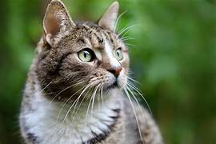
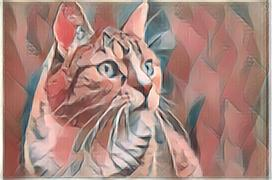
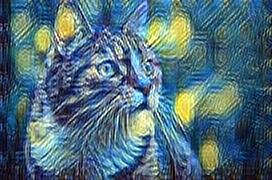
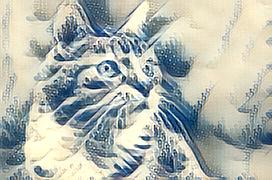
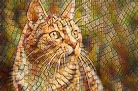

# 🎨 Neural Art Studio: Fast Neural Style Transfer

**Turn ordinary photos into masterpieces using Deep Learning.**

This project is an end-to-end Generative AI application that implements **Fast Neural Style Transfer** using PyTorch. Unlike traditional optimization-based methods (which take minutes per image), this application uses a feed-forward transformer network to stylize images in **real-time**.

---

## 📸 Demo & Screenshots

Here is a demonstration of the model's capability to transfer different artistic styles onto the same content image.

| **Original Content** | **Picasso Style** |
| :---: | :---: |
|  |  |
| **Starry Night (Van Gogh)** | **The Great Wave (Hokusai)** |
|  |  |
| **Mosaic (Byzantine)** | **Live App Interface** |
|  | [**🚀 Click Here to Try the Live App**](https://fastnst-f78nxukokgrazfhplfrqjt.streamlit.app/) |

---

---

## 🚀 Key Features

* **Real-Time Inference:** Stylizes 1080p images in under 1 second using a pre-trained Transformer Net.
* **Multi-Style Support:** Includes 4 distinct artistic models:
    * 🎨 **Picasso** (Cubism)
    * 🌌 **Starry Night** (Van Gogh)
    * 🌊 **The Great Wave** (Hokusai)
    * ✨ **Mosaic** (Byzantine Art)
* **User-Friendly Interface:** Built with **Streamlit** for a responsive, "Glassmorphism" UI design.
* **High-Res Download:** Users can process and download full-resolution artwork.

---

## 🧠 Technical Architecture

This project implements the architecture proposed by **Johnson et al. (2016)** for Perceptual Losses for Real-Time Style Transfer.

### The Pipeline
1.  **Image Transformation Network:** A deep residual convolutional network (ResNet architecture) transforms the input image.
2.  **Loss Network (VGG-16/19):** A pre-trained VGG network is used to calculate:
    **Content Loss:** Euclidean distance between feature maps of the input and output (preserves structure).
    **Style Loss:** Frobonius norm of the difference between the **Gram Matrices** of the style image and output image (preserves texture/color).
3.  **Optimization:** The network is trained on the COCO dataset (~80k images) for 2 epochs per style to minimize total perceptual loss.

**Tech Stack:**
* **Deep Learning:** PyTorch, Torchvision
* **Image Processing:** PIL (Pillow), NumPy
* **Web Framework:** Streamlit
* **Deployment:** Streamlit Community Cloud / GitHub Actions

---
